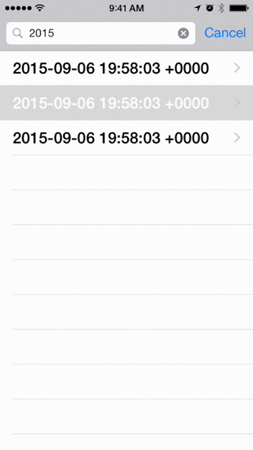

This sample project originated from [a StackOverflow question asking how to push a view controller onto a modally presented search results controller](http://stackoverflow.com/q/32278731/4151918).

Since the search controller presents its results on top of the underlying navigation controller, its search bar would continue to obscure the navigation bar of any view controller pushed onto the navigation controller's stack.

The effect to reproduce can be seen in Apple's **Calendar** and **Phone** app, when details are pushed from *filtered* search results.

This is obviously supported by Apple's private API, as it can push an embedded view controller, or change the transition style of the navigation bar.

I believe we are limited to two approaches.

A.  Dismiss or hide the presented search controller, so a pushed view controller would not have its bar obscured, or

B.  Present a modal embedded view controller above the presented search controller.

The issue with the first choice is that the search results would need to be restored after the pushed details are popped.

I chose to leave the search results on screen and present  the details on top of the search results.

Since a modal presentation doesn't have a built-in push transition, I thought it would be an interesting exercise to reproduce this effect for an interactive custom transition.

As is, the code is not robust or ready for use in an actual app, as there are cases it doesn't handle.

You're welcome to use it as you see fit, but it would need more time and attention to turn it into something other than a concept illustration.

# License

Details about the shadow effect, and content opacity and width came from [a SlideAnimatedTransitioning gist by Visnu Pitiyanuvath](https://gist.github.com/visnup/10944972).  Please refer to their code for any license details.

The sample code I wrote is covered by [the MIT license](License.txt).

# Inappropriate hacks

## Back button on presented view controller

The detail view is the root view controller for its presented navigation controller.

To get a back button to appear, I inserted a navigationItem at the front of the navigation bar's items array.  There is no underlying controller associated with that item.

    NSMutableArray *items = [navigationController.navigationBar.items mutableCopy];
    UINavigationItem *navigationItem = [[UINavigationItem alloc] initWithTitle:@"Back"];
    [items insertObject:navigationItem atIndex:0];
    [navigationController.navigationBar setItems:[items copy]];
    
`navigationBar:shouldPopItem:` ignores that pop, and dismisses the presented modal view controller.

I would say, "Don't try to deceive the SDK."  Use a custom left button.

# Areas that need attention

- If the search results controller keyboard is visible, it will properly dismiss before the presentation, but appear too soon during the dismissal.

- The back button hack affects the backButtonImage tint from being refreshed.

- The shadow on the presented modal view is full-height, leading to a "flicker" where the presenting and presented navigation bars touch.

- In landscape, the search bar height differs from the presented bar height.
